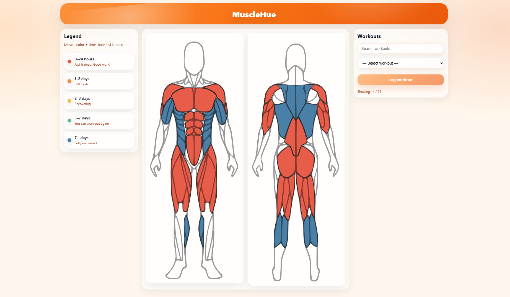

<h1 align="center">MuscleHue</h1>

<p align="center">
  Welcome to my app MuscleHue! a small solo project where the goal was to create an app that keeps track of your muscles' recovery by showing an anatomical model with colored muscles.
</p>

<p align="center">
  <a href="#demo--screenshot">Demo / Screenshot</a> ·
  <a href="#features">Features</a> ·
  <a href="#tech-stack">Tech Stack</a> ·
  <a href="#getting-started">Getting Started</a>
</p>

## Demo / Screenshot

**Demo video:** [_YouTube Link_](https://www.youtube.com/watch?v=8csaE0v_7fA)

### Screenshot



## Features

- **Interactive Anatomical Muscle Model:** Visualizes muscle groups with dynamic color changes based on recovery state.
- **Workout Logging UI:** Log workouts easily using a dropdown menu on the right side of the interface.
- **Muscle-to-Workout Mapping:** Each workout automatically updates the corresponding muscle groups tied to it.
- **Dynamic Recovery Visualization:** Muscles change color immediately after being worked out and gradually shift as they recover over time.

## Tech Stack

### Frontend

- **React** (UI)
- **Vite** (dev server & build)
- **vite-plugin-svgr** (To import and use SVG images as React components)

### Backend

- **Node.js + Express** (REST API)
- **MongoDB + Mongoose** (data persistence / ORM)

## Getting Started

### Prerequisites

This project currently runs **locally only** (no hosted backend yet).
To run it on your machine, you’ll need:

- **Node.js** (LTS recommended)
- **MongoDB** (local instance)

### Installation

Clone the repository, then install dependencies for both the client and server.

```bash
git clone <YOUR_REPO_URL>
cd <YOUR_REPO_NAME>
```

#### Install client dependencies

```bash
cd client
npm install
```

#### Install server dependencies

```bash
cd ../server
npm install
```

### Run Locally

You’ll need to run **both** the backend server and the frontend client.

#### 1) Start the backend

From the project root:

```bash
cd server
```

Start the server

```bash
node index.js
```

#### 2) Start the frontend

Open a new terminal, then from the project root:

```bash
cd client
npm run dev
```

#### Local URLs

- Frontend: `http://localhost:5173`
- Backend: `http://localhost:3000`

## Roadmap / Remaining Tasks

- [ ] **More detailed anatomical model:** Add additional muscle groups and increase visual granularity.
- [ ] **Custom workouts:** Allow users to create their own workouts and select which muscles they target.
- [ ] **Primary vs. secondary muscles:** Let users mark muscles as primary or secondary; secondary muscles require one less rest day.
- [ ] **User profiles:** Enable account creation and login to save personal data.
- [ ] **Gender-based anatomical model:** Change the anatomical model based on the user’s selected gender.

## Known Issues / Limitations

- **Demo configuration:** The AI prompt is currently set to generate **one activity per day** for **one week** only.
- **Single goal per user:** Each user can only have **one active goal** at the moment (multiple goals are not supported yet).

## Project Context

Built as a solo project in the Codeworks Fullstack bootcamp.

## License

MIT
